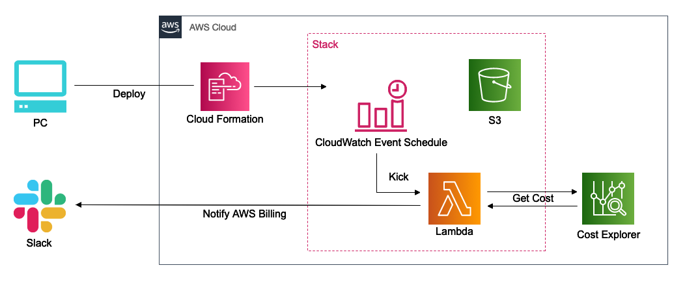

# Notify AWS Billing

Serverless Application for notifies AWS billing to slack.

<br>

## Architecture Image

<p align='center'></p>

<br>

## Requirements

* awscli
* docker 19.03.0
* docker-compose
* node/npm
* python 3.8
* pip
* pipenv
* serverless framework
* slack webhook url

<br>

## Required Settings

#### AWS PROFILE

Requires the IAM user granted the `AdministratorAccess` or the IAM user granted the appropriate permission.

```sh
% aws configure --profile foobar
```

<br>

## Getting Started - Use Docker

1. Create `.env`
2. Create the docker image n container
3. Create a new Bash session in the container
4. Introduction
5. Invoke

1:

Define the following variables to `.env` .

* AWS_PROFILE
* WEBHOOK_URL

2:

```sh
% make up
```

3:

```sh
% make exec
```

4:

```sh
% npm i
% pipenv install -r requirements.txt
```

5:

```sh
% pipenv shell
% make invoke-local
```

<br>

## Getting Started - Use Host

1. Export the environment variables
2. Introduction
3. Invoke

1:

```sh
% export AWS_PROFILE=foobar
% export WEBHOOK_URL='https://hooks.slack.com/services/T00/B00/XXX'
```

2:

```sh
% npm i
% pipenv install -r requirements.txt
```

3:

```sh
% pipenv shell
% make invoke-local
```

<br>

## Deploy

Deploys your entire service:

```sh
% make deploy-dev # to development

% make deploy-prd # to production.
```

Deploys an function:

```sh
% make deploy-func-dev # to development

% make deploy-func-prd # to production
```

Invokes deployed function:

```sh
% make invoke-dev # of development

% make invoke-prd # of production
```

<br>

## Remove the deployed service

```sh
% make rm-dev # from development

% make rm-prd # from production
```

<br>

## License

This software is released under the MIT License, see LICENSE.
